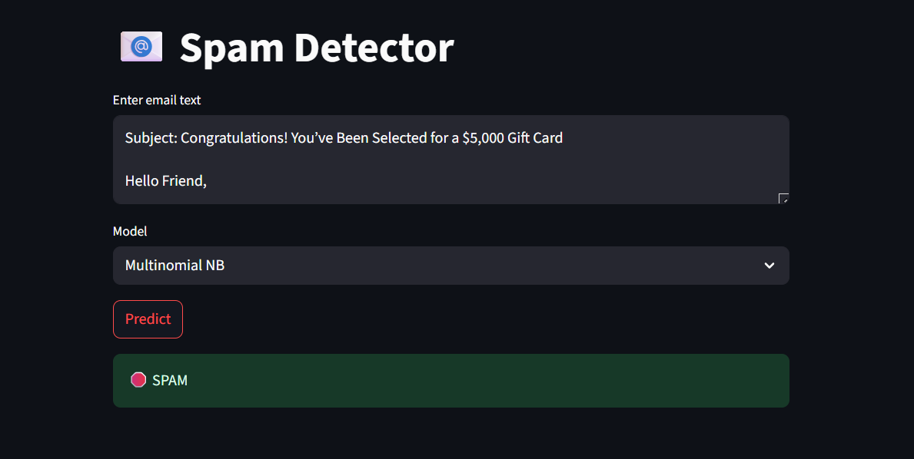

# SpamBlocker

An interactive web app that classifies emails as spam or ham using state‑of‑the‑art NLP preprocessing and multiple ML models, deployed via Streamlit for real‑time predictions.

**GitHub:** [https://github.com/adarshmishra1310/Spam-Email-Classifier](https://github.com/adarshmishra1310/Spam-Email-Classifier)

---

## Directory Structure
```
Spam-Email-Classifier/
├── LICENSE                             # MIT License
├── .gitattributes                      # Git attributes
├── requirements.txt                    # Python dependencies
├── data/                               # Dataset
│ └── spam.csv                          # Labeled email data
├── notebook/                           # Exploration & training notebooks
│ ├── .ipynb_checkpoints/
│ └── spam_classification.ipynb         # All Code
├── DTC.pkl                             # Saved Decision Tree model
├── LR.pkl                              # Saved Logistic Regression model
├── MNB.pkl                             # Saved Multinomial NB model
├── cv.pkl                              # Saved CountVectorizer pipeline
└── app.py                              # Streamlit testing script
```

## Setup & Build

```bash
# 1. Clone the repository
git clone https://github.com/adarshmishra1310/Spam-Email-Classifier.git
cd Spam-Email-Classifier

# 2. Create a virtual environment (optional but recommended)
python3 -m venv venv
source venv/bin/activate   # Windows: venv\Scripts\activate

# 3. Install dependencies
pip install -r requirements.txt
```

## Run
```bash
streamlit run Deploy_Streamlit/app.py
```

## 📽️ Demo

